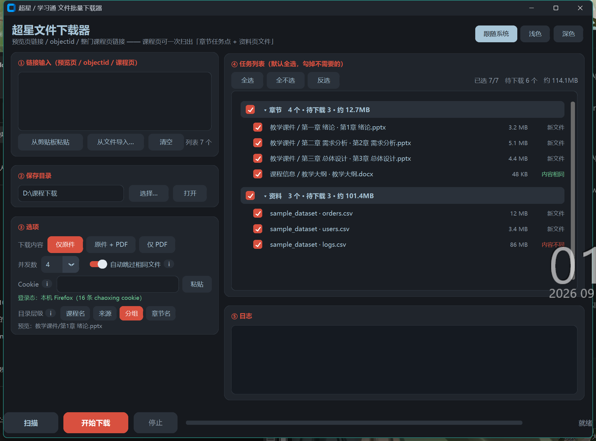
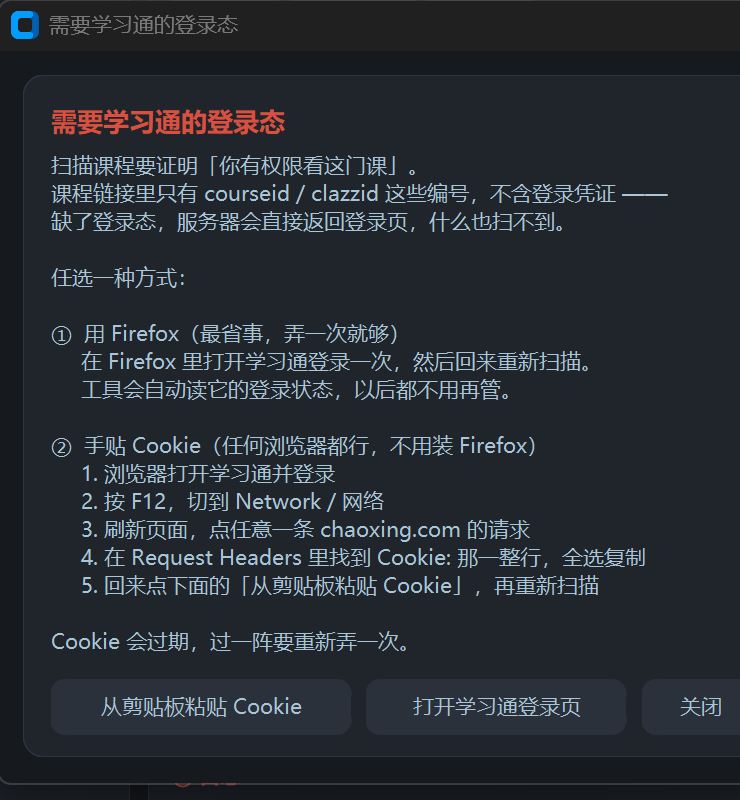

# 超星文件下载器

一个给**超星学习通**课程批量下载课件的小工具（Windows）。

粘贴课程页链接 → 扫描出全部附件 → 勾选要的 → 一键下载。
**章节任务点**和**「资料」页**两个入口都会扫，本地已下过的自动跳过。



---

## 它解决什么

学习通把课件散落在两个地方，而且都不让你痛快地下载：

- **章节页**：每个任务点是个在线预览的 PPT/PDF，得一个个点开、复制链接；
- **资料页**：文件夹里的东西连预览都没有，只能一个一个手点。

这个工具把两个入口都扫出来列成一张表，让你挑着下。一门 11 个课件的课，
从"点十几次 + 复制十几次链接"变成"粘一次链接 → 点两下"。

---

## 功能

| | |
| --- | --- |
| **两个入口一起扫** | 章节任务点 + 「资料」页（递归展开文件夹） |
| **先扫再挑** | 列表默认全选，不需要的取消勾选 |
| **按来源分组** | 「章节」「资料」两组，可折叠，组头显示个数 / 体积 / 待下载数 |
| **自动查重** | 本地已有且**内容相同**的文件自动跳过；换过目录/层级则交给字节数校验兜底 |
| **原件 / PDF** | 可只下原件、只下 PDF、或两个都要 |
| **目录层级可选** | 课程名 / 来源 / 分组 / 章节名，四级自由勾选，实时预览落点 |
| **命令行版** | `cx_download.py` 只用标准库，可以塞进脚本里 |
| **可打包** | 一条 `build.ps1` 出单文件 exe，自带冻结自检 |

---

## 快速开始

### 方式一：直接用 exe

从 [Releases](../../releases) 下载 `超星文件下载器.exe`，双击即可，**不需要装 Python**。

> exe 是 PyInstaller 打的单文件包，**杀软误报很常见**，需要的话加一下白名单。
> 首次启动要解压到 `%TEMP%\_MEIxxxx`，会慢几秒。

### 方式二：跑源码

```powershell
pip install customtkinter
python cx_download_gui.py
```

---

## 登录态（**最容易卡住的地方**）

**课程链接里没有登录凭证。** 链接里的 `courseid / clazzid / cpi / enc` 只回答
「要看哪门课」，不回答「你是谁」——真正证明身份的是 Cookie。
缺了登录态，服务器直接返回登录页，什么也扫不到。

任选一种方式：

**① 用 Firefox（最省事）**
在 Firefox 里打开学习通登录一次就行，之后工具会自动读取它的登录状态。
（Firefox 的 cookie 是明文存在 `cookies.sqlite` 里的，读起来不需要解密。）

**② 手贴 Cookie（任何浏览器都行，不用装 Firefox）**

1. 浏览器打开学习通并登录
2. 按 `F12`，切到 **Network / 网络**
3. 刷新页面，点任意一条 `chaoxing.com` 的请求
4. 在 **Request Headers** 里找到 `Cookie:` 那一整行，全选复制
5. 回到工具点「粘贴」（直接粘整段请求头也行，会自动截取），再重新扫描

> Cookie 会过期，过一阵要重新弄一次。

界面上每个 `ⓘ` 圆圈鼠标悬停都会展开对应的说明，不用记这些。



---

## 命令行版

`cx_download.py` **只依赖标准库**，不用装 customtkinter：

```powershell
# 单个文件（公开预览链接或 32 位 objectid）
python cx_download.py "https://mooc1.chaoxing.com/ananas/modules/pub/preview.html?objectid=xxxx"

# 整门课：章节任务点 + 资料页，按课程名建子目录
python cx_download.py "https://mooc2-ans.chaoxing.com/mooc2-ans/mycourse/stu?courseid=..&clazzid=..&cpi=.."

# 只扫章节，不扫资料
python cx_download.py <课程链接> --no-data

# 其它
-f, --files      从文本文件读链接（每行一条，支持 # 注释）
--clip           从剪贴板读
-o, --out DIR    保存目录（默认 ./cx_download）
--pdf / --pdf-only
--jobs N         并发数（默认 4）
--cookie STR     手动指定 Cookie（默认自动读 Firefox）
--overwrite      强制重下已存在的文件
--timeout N      单请求超时秒数（默认 60）
```

**注意**：给课程页链接时命令行版会**同时扫章节和资料**，不再弹出勾选界面 ——
要挑着下请用 GUI。

---

## 打包成 exe

```powershell
pip install pyinstaller
pwsh -NoProfile -File build.ps1
```

产物在 `dist\超星文件下载器.exe`（约 31 MB）。

> `build/` 和 `dist/` 都在 `.gitignore` 里：31 MB 的二进制进了 git 历史就永久撑大仓库，
> 而且每次构建都不一样。**要发给别人请挂到 GitHub Releases**，别提交进仓库。

构建脚本会：

1. 校验源文件齐全
2. 缺图标就调 `make_icon.py` 生成
3. 按 `cx-download.spec` 打包（`--collect-all customtkinter` 是必须的，
   它的主题 JSON / 字体是**数据文件**，漏了会白屏且不报错）
4. **用出货的那个 exe 自己跑 `--selftest`**，验依赖收集 / HTTPS / 写盘

```powershell
pwsh -File build.ps1 -SkipSelftest     # 只打包
pwsh -File build.ps1 -NoNetwork        # 自检不联网
pwsh -File build.ps1 -SelftestOids <oid>,<oid>   # 换自检样例
```

---

## 项目结构

```
cx_download.py          核心：链接解析、课程扫描、下载（纯标准库，可单独当 CLI 用）
cx_download_gui.py      CustomTkinter 界面
selftest.py             冻结自检，跑在出货的 exe 内部
build.ps1               打包 + 自检
cx-download.spec        PyInstaller 规格
make_icon.py            生成 app.ico
app.ico
docs/                   README 用的截图
历史版本/                每次较大改动的存档（改动前那一版 + README 说明）
```

---

## 历史版本

每做一次推倒重来式的改动，都会把**改动前那一版**原样存档，并配一份
`README-历史版本说明.md`，写清：为什么改、改了哪些文件、改动前后的结果对比、
对下游的影响、怎么回滚。

| 版本 | 目录 | 改了什么 |
| --- | --- | --- |
| v1 | `历史版本/GUI改CustomTkinter-v1-20260916/` | 界面从 tkinter/ttk 换成 CustomTkinter |
| v3 | `历史版本/课程页批量下载-v3-20260916/` | 支持整门课程页：自动扫章节任务点 |
| v4 | `历史版本/扫描勾选下载-v4-20260916/` | 改成「扫描 → 勾选 → 下载」，加内容查重 |
| v5 | `历史版本/资料页扫描-v5-20260916/` | 加「资料」页扫描（递归文件夹） |
| v6 | `历史版本/分组折叠-v6-20260917/` | 任务列表按来源分组可折叠；目录层级可选；修「扫完改保存目录不生效」 |
| v7 | `历史版本/登录态引导-v7-20260917/` | 登录态引导弹窗、Cookie 一键粘贴、ⓘ 悬停说明 |

---

## 技术备忘

几个踩过的坑，都写在对应的历史版本 README 里：

- **`/ananas/status/` 返回的 `crc` 不是文件内容的哈希**（md5/sha1 都对不上），
  所以查重改用 **字节数 + 前 64KB 的 md5**，靠 `d0.cldisk.com` 的 HTTP Range 支持
  只取 64KB，不用整包重下。
- **`CTkCheckBox` 的最小宽度收不住**：`width` 填 70、实际 `winfo_reqwidth()` 是 122，
  一排四个会把列撑爆 —— 所以目录层级那排是自绘的 `CTkButton`。
- **普通 Tk 字体不跟 CTk 的 DPI 缩放走**：CTk 的 `12` 在 175% 缩放下是 21px，
  Tk 的 `10` 是 10 磅 ≈ 13px。悬停气泡要按 `ScalingTracker` 换算成像素字号
  （Tk 里负数 = 像素）。
- **`Canvas.create_window()` 用的 widget 必须是这个 Canvas 的子控件**，
  挂到 Toplevel 上的话窗口项不渲染，表现为气泡是空的一块。
- **`_fit_geometry` 只设尺寸不够**：窗口默认由系统随便摆，高一点的会被摆到屏幕外，
  底部按钮就看不见了 —— 得连位置一起算并夹在屏幕内。

---

## 已知限制

- **只抓文档类任务点**（`ans-attach-online`：pptx / docx / pdf / xlsx 等）。
  视频、测验、讨论没有可下载文件，会显示 0 个附件。
- **查重是「字节数 + 前 64KB md5」**，理论上存在前 64KB 相同、总字节数也相同的
  不同文件被误判 —— 对课件场景可以忽略。
- **不支持 Chrome / Edge 自动读 cookie**，也不打算做：Chrome 127+ 的
  App-Bound Encryption 一更新就可能失效，而且「读浏览器 cookie 库 + 解 DPAPI」
  是信息窃取木马的标准行为，杀软基本会拦。手贴 Cookie 已经覆盖所有浏览器。
- **登录页识别靠特征字符串**（`LOGIN_MARKERS`），学习通改版可能要跟着调。
- 「资料」页的下载直链是从行内 HTML 抓的（`operate_down` 这个 class），
  改版同样要跟着调。

---

## 免责声明

仅供**下载自己有权访问的课程资料**、方便离线复习使用。
请遵守所在学校的规定和平台的服务条款，不要用于传播或商业用途。

---

## License

[MIT](LICENSE)
